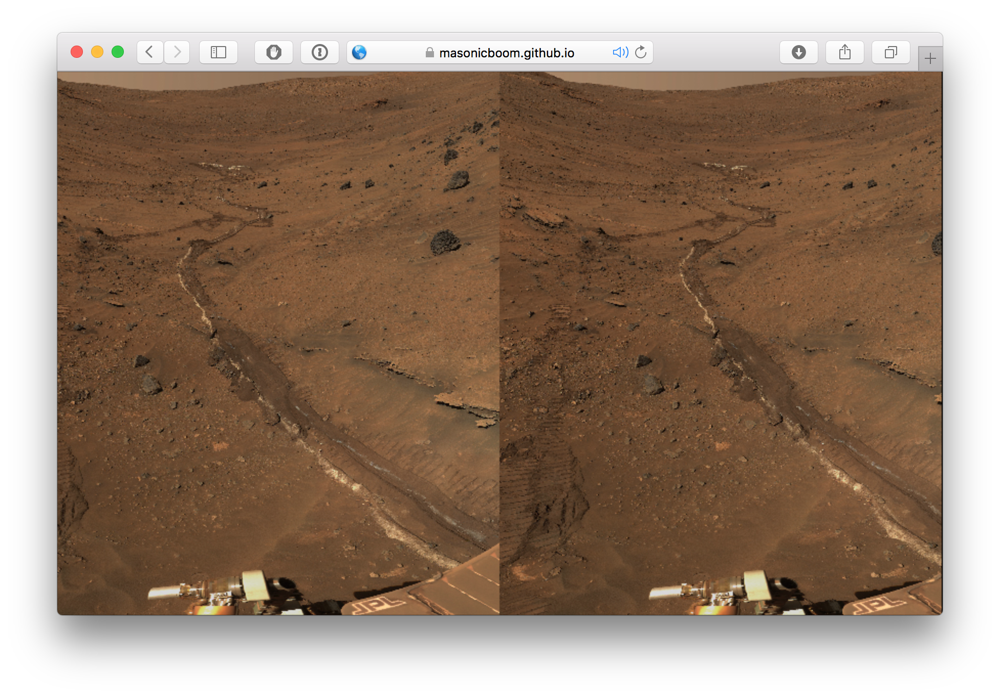

## Intro

This project is a proof-of-concept, showing how to use Facebook's [React](http://facebook.github.io/react/) to generate a VR experience that works with [Google Cardboard](https://www.google.com/get/cardboard/).

Currently, it renders a [panorama of Mars taken by NASA](http://mars.nasa.gov/mer/gallery/panoramas/spirit/), in [stereoscopic 3D](https://en.wikipedia.org/wiki/Stereoscopy).

There's also a demo letting you view the famous [Utah teapot](https://en.wikipedia.org/wiki/Utah_teapot).

## Demo

There are two demos:

1. Panorama of mars, that you can look around by turning your head (in a Cardboard viewer): [View Demo](https://masonicboom.github.io/react-cardboard/panorama/).
1. The Utah teapot, which you can rotate by turning your head (in a Cardboard viewer): [View Demo](https://masonicboom.github.io/react-cardboard/object/).

These will work in a desktop browser (tested in Chrome and Safari), but are best viewed in a Google Cardboard viewer (tested with iPhone 5s and [Mattel View-Master](http://www.view-master.com)).

## Usage

First, you'll need to have `npm` installed. It comes with [node](https://nodejs.org/). [`tsd`](http://definitelytyped.org/tsd/) is optional (but recommended) if you want type definitions for use in TypeScript; install it with `npm install -g tsd` if you don't already have it.

### Live-rebuilding (development)

		npm install
		tsd install # Optional.
		node_modules/.bin/bower install
		node_modules/.bin/tsc
		node_modules/.bin/webpack-dev-server --content-base www/
		open http://localhost:8080/

To access the dev server from your phone, you may need to specify your computer's IP address in a `--host` parameter to `webpack-dev-server`.

### Static building (deployment)

		npm install
		tsd install # Optional.
		node_modules/.bin/bower install
		node_modules/.bin/tsc
		node_modules/.bin/webpack
		# Files are in www/ directory.

## References

- http://threejs.org - 3D library for JavaScript.
- https://github.com/Izzimach/react-three - React wrapper around three.js. This project relies on a [forked version of react-three](https://github.com/masonicboom/react-three) that I hacked-up to support stereoscopic rendering.
- https://github.com/borismus/webvr-polyfill - Used to control the camera (what you're looking at) based on device orientation sensors. This is what lets you look around the panorama by turning your head (when your phone is in a Google Cardboard viewer).
- https://github.com/borismus/webvr-boilerplate - Used as a reference to figure out how to use webvr-polyfill.
- https://www.reddit.com/r/GoogleCardboard/comments/39t5tl/7000_subscribers_extra_basic_cardboard_questions/ - Introductory info about Google Cardboard.

## Future Work

1. Build a UI that lets you show a component in the normal flow of a webpage, but then activate it and jump into VR-mode. E.g. you're on an e-commerce website like Amazon, and you jump into a VR preview of a product. https://github.com/borismus/webvr-boilerplate does something like this, but I think we can do it in a cleaner way with React.
1. Calibrate the rendering using Google Cardboard viewer QR codes.
1. Expose a React component with a simple interface for rendering panoramas (like the one in the demo).
1. Expose a React component with a simple interface for rendering a single object that you can orbit around (rather than pivoting the camera).

Contributions are welcome. Send a PR.